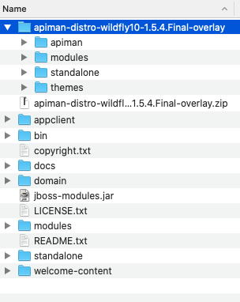

# Getting Started with Apiman

## **Introduction:**

Apiman is an API management tool optimized for open source projects, meaning it lets you implement enterprise-grade API management functionality served using a fast, secure, and low overhead API Gateway..

## **Common Use Cases:**

* Easily and securely implement API Governance, defining and managing runtime governance policies for different API consumers.
* Rich management layer makes it easier to manage your APIs as well as configure the client applications that consume them.
* Centralized control of security, client consumption quotas, and API usage metrics and billing, letting you share common functionality across different API implementations for different user types and security policies.
* Embed API usage and security on client applications using small footprint ‘embeddable’ management environment that can be run independently from the APIman management layer supporting both standard Java EE environments as well as newer asyc runtimes like vert.x.

## **Apiman End Users:**

This Apiman getting started guide is written with the following enterprise end users in mind:

* API Providers
* API Consumers
* Management Admins
* Developers

You can find more detailed information and other training resources on the [Apiman Crash Course.](http://www.apiman.io/latest/crash-course.html#_introduction)

## **Getting Started**

Apiman requires WildFly Application Server \(these instructions are for version 10.1.0.Final\).  You can learn more about [setting up and using WildFly here.](http://www.apiman.io/latest/download.html)

### **Getting Started Using Docker**

You can quickly get started by using a preconfigured Docker image with everything you need by [following the instructions on this page.](http://www.apiman.io/latest/download.html)

### **Getting Started using Manual installation**

#### **Download WildFly & Apiman Distributable**

1. Download & Unzip the [WildFly 10.1.0.Final distributable.  ](http://download.jboss.org/wildfly/10.1.0.Final/wildfly-10.1.0.Final.zip)
2. Download the Apiman 1.5.4.Final overlay for WildFly 10, making sure you download and unzip the file into the same folder folder as WildFly.

Your ****local folder should look something like this:



#### **Unpack & Install Packages**

1. Unpacking the WildFly zip file \(see image above\) is basically all you need to do to setup WildFly.
2. Next unpack the Apiman zip file creating the folder structure similar to the image above.
3. Run the Apiman Standalone.sh script using the Standalone-apiman.xml configuration file \(it can be found inside the **/bin/** folder \(see image above\).
4. Running the above script will launch version of Apiman running on your local WildFly  app server.  You can now access your Apiman application using the browser pointed to [http://localhost:8080/apimanui/](http://localhost:8080/apimanui/) and logging in using the admin/admin123! credentials.


Goes without saying that you should change the username and password using the built in Keycloak application available locally at [http://localhost:8080/auth/admin/](http://localhost:8080/auth/admin/).


#### Installation using Bash Commands

Create a new directory where you will download the Apiman distributable, and change directory into this new location:

```bash
mkdir ~/apiman-1.5.4.Final
cd ~/apiman-1.5.4.Final
```

Download and Unzip the WildFly & Apiman zip files:

```bash
curl http://download.jboss.org/wildfly/10.1.0.Final/wildfly-10.1.0.Final.zip -o wildfly-10.1.0.Final.zip
curl http://downloads.jboss.org/apiman/1.5.4.Final/apiman-distro-wildfly10-1.5.4.Final-overlay.zip -o apiman-distro-wildfly10-1.5.4.Final-overlay.zip
unzip wildfly-10.1.0.Final.zip
unzip -o apiman-distro-wildfly10-1.5.4.Final-overlay.zip -d wildfly-10.1.0.Final
```

Change directory into your newly unzipped Apiman folder and run the above mentioned script launching Apiman with the configuration file standalone-apiman-Final.xml:

```bash
cd wildfly-10.1.0.Final
./bin/standalone.sh -c standalone-apiman.xml
```

Next you can login and change password exactly the same as in the previous section instructions.

## Setting up and using a sample API Provider and Consumer

TBD

